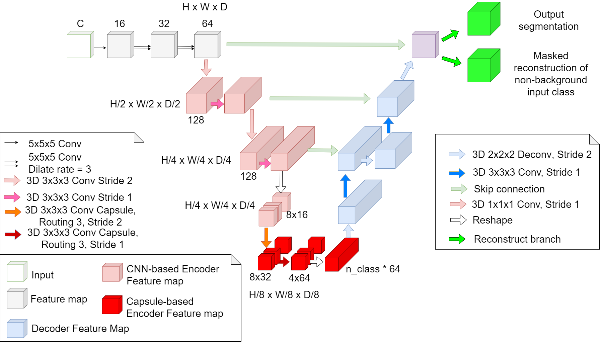

# 3DConvCaps: 3DUnet with Convolutional Capsule Encoder for Medical Image Segmentation
Table of Contents
* [Introduction](#introduction)
* [Usage](#usage)
* [Trained models](#trained-models)
* [Acknowledgement](#acknowledgement)
* [Citation](#citation)

# Introduction


The figure above illustrates our 3DConvCaps architecture. Details about it are described in our paper [here](https://arxiv.org/abs/2205.09299). The main implementation of this network can be find [here](module/mod_ucaps.py).

## Usage

### Installation
- Clone the repository:
```
git clone https://github.com/UARK-AICV-Lab/3DConvCaps
```

- Install dependencies depends on your cuda version (CUDA 10 or CUDA 11)
```
conda env create -f environment_cuda11.yml
or
conda env create -f environment_cuda10.yml
```

### Data preparation
Our method is evaluated on three datasets:
* iSeg-2017 challenge (infant brain MRI segmentation): <https://iseg2017.web.unc.edu/download/>
* Cardiac and Hippocampus dataset from Medical Segmentation Decathlon: <http://medicaldecathlon.com/>

See this [repository](https://github.com/VinAIResearch/3D-UCaps) for more details on data preparation.

### Training
The training example script is available [here](scripts/train_3dconvcaps.sh)

### Validation
The evaluating example script is available [here](scripts/eval_3dconvcaps.sh)

See this [repository](https://github.com/VinAIResearch/3D-UCaps) for more details on training and evaluating parameters.

## Trained models
Our trained 3DConvCaps models on three datasets can be downloaded as follows: 

- [iSeg-2017](https://uark-my.sharepoint.com/:u:/g/personal/minht_uark_edu/EcXhqKrOfp9BiAhru2x0vwABSeew_qcQ-RSTA8NYmYO0xg?e=ZPI0Nj)
- [Hippocampus](https://uark-my.sharepoint.com/:u:/g/personal/minht_uark_edu/Eag8cZNDQ7FMietkIa4RodMB8dMXcaMS9eXzJfnrubbZTw?e=fWqP3h)
- [Cardiac](https://uark-my.sharepoint.com/:u:/g/personal/minht_uark_edu/EeqQ4YJ9LSZDhpJ8eDehfLMBBGTnY4ovlvkBAHODATe4Lg?e=6NZA8G)


## Acknowledgement
The implementation is mainly based on [3DUCaps thorough implementation](https://github.com/VinAIResearch/3D-UCaps).
## Citation
```
@article{tran20223dconvcaps,
  title={3DConvCaps: 3DUnet with Convolutional Capsule Encoder for Medical Image Segmentation},
  author={Tran, Minh and Vo-Ho, Viet-Khoa and Le, Ngan TH},
  journal={arXiv preprint arXiv:2205.09299},
  year={2022}
}
```
## Contacts
If you have any question, feel free to open an issue.
